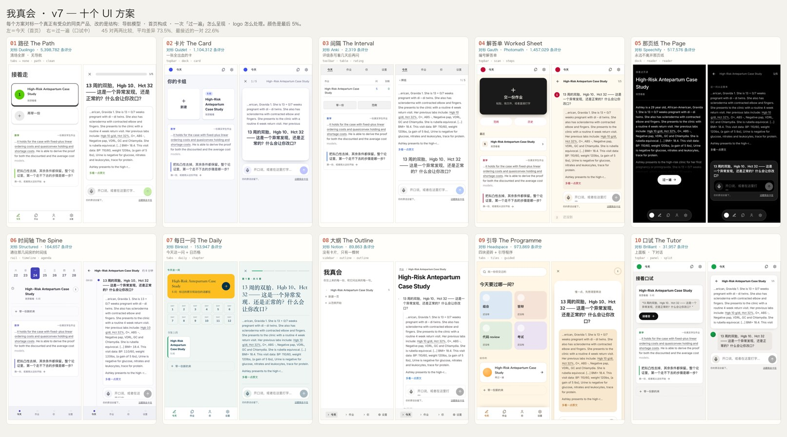

# v7 · Ten UI schemes, grounded in shipped products

Wang's brief for this overnight task, in his own words:

> 我不是要你做10个调色盘，我是要你给我10个不同风格的UI设计，你可以把排版、logo、甚至是为了UI把功能做出排版调整。
> 但是这10个方案都是要有所依据 …… 能让你对标的一定是成功、有一定受众群体的同类产品。

Two constraints follow from that, and everything below is downstream of them.

**A scheme is a structure, not a palette.** The first attempt at v7 overrode
colour tokens ten times and shipped one layout. That is a re-skin. This version
changes navigation model, home composition, run-through presentation and logo
treatment — colour is the last five percent.

**A reference must have an audience.** Every scheme names one shipped product
and its App Store rating count. A mood board is not evidence that a design
works for people; five million ratings is at least an argument.

---

## Where the evidence came from

Competitor **websites** are marketing pages, not product UI, so they were
dropped. This round used **App Store product screenshots** — the actual in-app
interface — pulled through the iTunes Search API. Raw material:

- `memory/ireallyknow-v7/appstore/index.json` — 15 apps with rating counts
- `memory/ireallyknow-v7/appstore/*.jpg` — 45 in-app screenshots
- `memory/ireallyknow-v7/RESEARCH.md` — the structural read of all ten

Each app was read on six axes: navigation model · home anatomy · what the core
unit is made of · type system · brand-mark treatment · how one session is
presented. The last axis is the one that separates them most, and it became the
spine of the ten schemes.

---

## The ten

| # | Name | Reference | Ratings | Navigation | Home | Run-through | Logo |
|---|------|-----------|--------:|-----------|------|-------------|------|
| 01 | 路径 The Path | Duolingo | 5,398,782 | bottom tabs, **removed during a run** | vertical path of stops | clear-out: progress + exit only | mark only |
| 02 | 卡片 The Card | Quizlet | 1,104,312 | top bar: close · count · title | grid of decks | one full-bleed card that flips | wordmark |
| 03 | 间隔 The Interval | Anki | 2,319 | plain text toolbar | dense table: deck · new · due | bare text + **interval rating row** | none |
| 04 | 解答单 The Worked Sheet | Gauth · Photomath | 1,457,029 | top bar + tool row | one huge shutter action | numbered worked sheet | mark |
| 05 | 那页纸 The Page | Speechify | 517,576 | floating pill dock | the page of work itself | source fills the screen, question rises from a dock | mark |
| 06 | 时间轴 The Spine | Structured | 164,657 | left time rail | date strip + timeline | timed agenda | inline text |
| 07 | 每日一问 The Daily | Blinkist | 153,947 | bottom tabs | today's hero + DAY grid | chapter title page | wordmark |
| 08 | 大纲 The Outline | Notion | 89,863 | collapsible sidebar | nested tree, no cards | toggle rows inside the tree | inline text |
| 09 | 引导 The Programme | Headspace | 973,869 | bottom tabs | search + 2×2 tiles + programme card | one soft card, generous air | centred lockup |
| 10 | 口试 The Tutor | Brilliant | 31,957 | minimal top bar | panel rows with a tutor line | work above, conversation below | mark |

---

## The translations

Each entry answers one question: **if that team designed 「我真会」, what would
it look like?** — and then names what was deliberately *not* taken.

### 01 · 路径 — after Duolingo
Duolingo's practice screen has no navigation at all. The top carries two things:
how far you are and how much life you have left. Options are blocks too big to
mis-tap, with a solid 4px shadow that makes them feel pressable.

Translated: Today becomes a **path of stops** — one node per piece of work, the
next one widest. A run-through **removes the tab bar entirely** (`navInRun:
false`), leaving a progress bar, a count and an exit. The self-grade options
inherit the extruded block treatment, because choosing "站住了 / 有点虚 / 没站住"
is the same kind of act as choosing an answer.

Not taken: streaks, hearts, gems, or any loss framing. This product is not
allowed to punish someone for being honest about not knowing.

### 02 · 卡片 — after Quizlet
Quizlet reduces the screen to a single full-bleed card with `16 / 20` above it
and nothing else. The card is the product.

Translated: one question is one card. The source excerpt sits on the front above
the question; committing an answer **flips** it, and the back shows the student's
own words back to them. Home becomes a grid of decks — one per piece of work,
labelled with how many questions it holds.

Not taken: the score-and-streak layer. A flip that reveals your own sentence is
the useful half.

### 03 · 间隔 — after Anki
Anki has no decoration at all, and its bottom row is the whole interaction:
`1m Again · 10m Good · 4d Easy`. Every button says how long until it comes back.

Translated: **the button names the interval.** Our three self-grades already map
onto exactly that, so under this scheme they read
「站住了 · 7 天后再问」「有点虚 · 3 天后再问」「没站住 · 明天再问」.
This is the one place a scheme changes wording rather than arrangement, and it
is more honest than the base label, because that is what the choice actually does.
Home is a table: piece, open questions, due.

Not taken: Anki's configurability. The scheduler stays 1/3/7.

### 04 · 解答单 — after Gauth and Photomath
Both open with a shutter, not a dashboard, and both render an answer as a
numbered list of steps that expand one at a time.

Translated: home is **one enormous primary action** with a pill tool row under
it. A run-through is a **numbered worked sheet** — all questions visible as rows,
the current one open, answered ones collapsed with a check. You can see the shape
of the whole viva while you are inside it.

Not taken: the camera. Our input is text a student already wrote.

### 05 · 那页纸 — after Speechify
Speechify never leaves the text. The user's own document fills the screen, the
current sentence is highlighted, and a floating player hovers over it.

Translated: this is the closest fit of the ten. **The student's page is the app.**
Home is their last piece, set large and loose on black. During a run the source
fills the screen and the question **rises from a dock** at the bottom; answering
does not navigate anywhere. Brief §6.2 #10 says being read is the first thing
this product does for you — this scheme is that sentence as a layout.

Not taken: playback controls and speed. There is nothing being read aloud.

### 06 · 时间轴 — after Structured
Structured puts a horizontal date strip over a vertical timeline, each item with
a time in the gutter and a progress ring.

Translated: this product already has real dates — 组会 8/31, 答辩 9/12, and the
1/3/7-day returns — so a timeline is not decoration here, it is the data. Home is
the **spine to those rooms**. The rail becomes a time axis with today's date set
large at the top. A run-through is a **timed agenda**.

Not taken: the calendar-app density. One spine, not seven columns.

### 07 · 每日一问 — after Blinkist
Blinkist leads with one hero for today and keeps a `DAY 1…12` grid as a record of
showing up, with a serif display face for the thing that matters.

Translated: **今天这一问** is the hero. The day grid records the days something
actually held, not the days you opened the app. A run-through becomes a
**chapter** — "第 3 章 · 共 5 章" over a large serif question on its own page.

Not taken: the "finish in 15 minutes" framing. Speed is not the promise.

### 08 · 大纲 — after Notion
Notion has no cards. Everything is a nested toggle row, hover is a 5px grey
rectangle, and the page title is very large and plainly weighted.

Translated: 作业 → 每一遍 → 每一问 is already three levels deep, so the whole
product becomes **one collapsible tree**. The sidebar lists real pieces as pages,
because a "Work" tab that hides its contents would be the wrong product under
this scheme. A run-through happens **inside the tree** — questions are toggle
rows that open in place.

Not taken: databases, properties, and slash commands. The tree alone is the idea.

### 09 · 引导 — after Headspace
Headspace pairs warm sand with saturated pastel tiles, very round corners, and a
guided-programme card carrying a real face.

Translated: the rooms this product prepares you for become the **four tiles** —
组会 / 答辩 / 代码 review / 考试. A run-through is **one soft card with air around
it**, and this is the only scheme where slowness is the point: the copy says
「慢一点，先想清楚再说」.

Not taken: the meditation voice and the sleep content. Calm, not sedated.

### 10 · 口试 — after Brilliant
Brilliant splits the screen: an interactive panel on top, a tutor speaking in
bubbles below, with the verdict delivered as conversation.

Translated: **the work sits above and the examiner talks below.** The question is
a bubble from them, the answer is a bubble from you, and the verdict arrives in
the same thread — which is what an oral exam transcript actually looks like. Home
carries a tutor line under each piece, quoting the first question it will ask.

Not taken: the gamified course map. There is no syllabus here.

---

## How this is built

One codebase, four axes published on `<html>`:

```
src/app/scheme.ts            the ten definitions — nav · home · run · logo
src/app/NavVariants.tsx      six navigation models
src/screens/today/layouts.tsx      ten home compositions
src/screens/viva/presentations.tsx ten run presentations
src/styles/shapes.css        structure, keyed on [data-nav] / [data-home] / [data-run]
src/styles/ui/ui-NN.css      identity: face, weight, radius, depth, colour
```

Application logic is untouched. No scheme calls the model, decides a verdict,
changes the scheduler, or alters what is stored. That is what makes shipping ten
of them at once safe — and it is also the honest limit of the exercise: these are
ten *presentations* of one product, not ten products.

## Overview



Per-scheme screenshots are in `shots/` — `NN-today`, `NN-run`, `NN-self` at
390×844 and `NN-wide` at 1440×900. The pairwise difference matrix is in
`diff-report.json`.

## How to look at them

- In the app: **设置 → 外观方案**, or `#/schemes`
- By URL: `?ui=01` … `?ui=10`, `?ui=off` to go back to the base product
- Screenshots: `shots-v7/` — 390×844 for Today, run and self-grade, plus 1440×900

## How they are checked

`node shot-schemes.cjs` walks all ten and fails on any of:

- a page error in any scheme,
- text under WCAG AA on headings, navigation, secondary text or self-grade options,
- **a closest pair under 20% pixel difference** — the gate that would have caught
  the first attempt, where ten palettes over one layout differed by almost nothing.

Current run: 45 pairs, mean difference **73.5%**, closest pair **22.6%**
(01 vs 03 — both are restrained light schemes, which is the expected floor).
