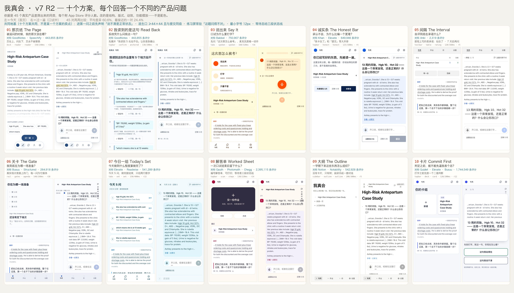

# v7 R2 · 十个方案，每个回答一个不同的产品问题

Wang 对第一轮的判决：

> 我认为你现在给我交付的10版，由于你前期的调研深度不够，所以这10版还是不够达标我要的效果。
> 我希望你重新调研，深度挖取成功大体量用户群的app的特征和内在UI设计和交互逻辑 ……
> 我要的不仅仅是交付的10个方案图。还要有设计逻辑、交互逻辑等思考给我。
> 最终的目的是找到一个最适合我这个项目的方案去决定它后面的功能方向。

他是对的。第一轮的调研只到「看应用商店截图」这一层，所以方案也只能到那一层：
十个对标对象各配一套外观。这一轮换了三件事——**证据的来源、对标的对象、方案的组织方式**。



---

## 一、这一轮的证据是怎么来的

| 层次 | 做法 | 产出 |
|---|---|---|
| 量 | 无痕 Chrome、iPhone UA、390×844，读 10 个真实产品的 computed style：按覆盖面积加权的字体组合、真实圆角分布、声明的过渡时长与缓动、常驻元素高度、可点元素命中尺寸 | [`MEASURED.md`](MEASURED.md) · [`measurements.json`](measurements.json) |
| 走 | 亲手走完 Khan Academy 的公开练习题（这批里唯一能完整走到「提交」的公开答题界面），记录控件清单与真实命中尺寸 | [`OBSERVED.md`](OBSERVED.md) |
| 比 | 用**同一把探针**量我们自己的四个屏，做数字对数字的差距表 | [`GAP.md`](GAP.md) · [`ours-measured.json`](ours-measured.json) |
| 筛 | App Store 池子从 10 个扩到 **45 个真实产品**（评分人数、类目、更新日期），按「解决的问题像不像」重筛对标对象 | [`REFERENCES.md`](REFERENCES.md) · [`appstore-pool.json`](appstore-pool.json) |
| 读 | 三个子代理只用 web_search / web_fetch 做文献层调研（官方设计博客、Anki 官方手册、UX teardown）。**它们把抓不到的地方写成「不确定」而不是编**——Quizlet 帮助中心被 Cloudflare 403 拦了三次、Notion 的 mobile 帮助页 404、Headspace 的 tab 组成没有官方截图 | [`research/`](research) |
| 提 | 把上面全部变成 **27 条可执行的交互模式**，每条写「是什么 / 谁在用+评分人数+证据文件 / 为什么 / 我们要不要用」。**形容词不许进这份文件** | [`PATTERNS.md`](PATTERNS.md) |
| 转 | 十个方案的完整规格：依据 · 设计逻辑 · 逐步交互逻辑 · 选它意味着什么 · 它解决不了什么 | [`SCHEMES-V2.md`](SCHEMES-V2.md) |

**如实标注的缺口**：Quizlet 的公开卡组页被 Cloudflare 人机验证挡住，这一轮没有它的第一手交互证据，
所以文档里不会出现「Quizlet 的动效是 X」这类没有来源的话。

---

## 二、调研推翻了第一轮的三个对标对象

| 第一轮 | 问题 | 换成 |
|---|---|---|
| Blinkist（153,947） | 内容是**别人写的摘要**，我们的内容是**用户自己写的**，同构性很弱 | **GoodNotes（443,855）**：上半屏是用户自己的那一页，下面是 `TELL ME MORE ABOUT` 话题芯片 + `SUGGESTED QUESTIONS`。**这就是「拿学生自己的材料生成问题」被一个 44 万评分产品做出来的样子** |
| Brilliant（31,957）的对话式判定 | 形状对，但用户量在这批里最小 | 形状保留，证据换成 **Babbel（750,907）**：`Listen, then say it out loud` + 底部中央大号麦克风 |
| Craft（6,595） | 用户量太小，不该作为依据 | 删除 |

新进池子并被采纳的还有：**Chegg（204,684）**常驻多模态输入坞与有内容的等待态、
**Elevate（539,777）**今日清单与 `[Skip][Submit]` 等宽、**Busuu（100,261）**练习屏顶栏的举报入口与检查点、
**Notability（453,065）**文档式结构、**Readwise** 的 Daily Review 单卡。

---

## 三、量出来的三条，直接改掉了产品

### 1 ⛔ 这个产品最想要的行为，按钮最小

我们「过一遍」屏的实测：

| 元素 | 尺寸 |
|---|---|
| 麦克风 | 52 × 52 |
| 提交 | 52 × 52 |
| 多看一点原文 | 84 × 40 |
| 先离开 | 80 × 40 |
| **这题我会卡住** | **78 × 19** |

对照：Khan `[Skip 44×40]` 与 `[Check 130×40]` 并排；Elevate `[Skip][Submit]` 等宽。
**两个独立产品、65 万+评分，都把逃生口放在提交旁边。**

这个产品的整个论点是「诚实地承认哪句话没站住」，而界面在用尺寸告诉学生：
**编一个答案比承认卡住更容易**——而编答案直接摧毁我们唯一在卖的那个判断。
**修复**：`.s-stuck` 现在 ≥44×44，与剩余问数同排；方案 04 更进一步，把提交也写成文字按钮放在同一行。

### 2 我们完全没有「这题问得不对」的出口

Busuu 把举报旗放在练习屏顶栏，Khan 有 `Report a problem 106×44`——而**他们的题库是人写的**。
我们的问题是**模型现场生成的**，出错是结构性常态。没有出口，学生只能把「题错了」误读成「我不会」，
这会直接污染我们唯一要产出的那个数。
**修复**：`Probe.flagged` 落库，十个方案的练习屏都常驻 `FlagButton`。被标记的问题仍然计入已答，
但**排除在校准比较之外**——一个被学生否定的问题，说明不了他judge 自己judge 得准不准。

### 3 排版：字号在退，字重在冲

同类最小值：Khan 13.1px、Quizlet 12px/600、Headspace 12px/500、Notion 14px。
**我们有 11px 配 760 字重在跑**，这是层级没定清的症状。
**修复**：新增门禁 [`verify-type-floor.mjs`](../../verify-type-floor.mjs)——
任何上线样式不得低于 **12px**，且 12px 处字重不得超过 **600**（可打印文档另计）。
首次运行报出 **39 处违规**，全部修掉后并入 `npm run build`。

### 4 等待态

Chegg 把等待做成一屏有内容的东西：`Sent → Working → Answered` 三段线 + 一句人话 + 两个不用干等的出口。
我们原本是一个转圈，而那几秒恰好是学生刚对自己的作业下过一次断言、最紧张的时刻。
**修复**：判定等待改为三段状态线，并明说「不用等在这里，回来时还在这一问」。

---

### 5 ⭐ 调研回来后，新增了一条**禁令**并把它变成门禁

Anki 的手册对「机器不判定」这件事说得很直白：四颗自评按钮**只在答面出现**，
而 type-in-the-answer 只是把「你写的」和「标准答案」并排给你看，
原话是 *"it's still up to you to decide how well you remembered or not."*
（`docs.ankiweb.net/studying.html#answer-buttons`、`templates/fields.html#checking-your-answer`）

理由不是礼貌。**一旦机器先说了对错，后面的自评就不是自评，是学生在复读机器**——
而「学生宣称的」与「实际站住的」之间那个落差，是这个产品唯一在产出的数。
提前给判定，等于在源头把它毁掉。

我们的顺序（答 → 自评 → 判定）本来就是对的，但那只是**当前实现恰好正确**，没有任何东西守着它。
现在有了：[`verify-no-early-verdict.mjs`](../../verify-no-early-verdict.mjs) 检查四处判定渲染
（判定标记 / 判定行 / 原文锚点着色 / 原文卡片的判定色）**是否都被 revealed 相位守住**，
外加调用顺序（模型不得早于自评）与等待态不得泄漏判定。已并入 `npm run build`。

---

## 四、十个方案

完整规格（每个含依据 · 设计逻辑 · 逐步交互逻辑 · 选它意味着什么 · 它解决不了什么）在
[`SCHEMES-V2.md`](SCHEMES-V2.md)。总表：

| # | 名字 | 它回答的问题 | 依据（评分人数） |
|---|---|---|---|
| 01 | 那页纸 | 被追问的时候，我的原文该在哪？ | GoodNotes 443,855 · Speechify 517,576 |
| 02 | 我读到的是这句 | 系统凭什么问我这一句？ | GoodNotes 443,855 |
| 03 | 说出来 | 口试为什么要打字？ | Babbel 750,907 |
| 04 | 诚实条 | 承认不会，为什么比编一个更难？ | Khan 110,169 · Elevate 539,777 |
| 05 | 间隔 | 自评到底在承诺什么？ | Anki |
| 06 | 关卡 | 我到底在为哪一场准备？ | Busuu 100,261 · Structured 164,657 |
| 07 | 今日一组 | 今天做到什么程度算做完了？ | Elevate 539,777 · Readwise |
| 08 | 解答单 | 一次口试结束后留下什么？ | Gauth 1,457,502 · Photomath 732,929 · Chegg 204,684 |
| 09 | 大纲 | 一学期下来这些东西怎么组织？ | Notion 89,863 · Notability 453,928 |
| 10 | 卡片 | 判定之前，能不能先逼我表个态？ | Quizlet 1,104,312 · Elevate 539,777 · Busuu 100,261 |

**十个共同吃下的地基**：逃生口 ≥44×44 且与提交同级 · 练习屏常驻「这题问得不对」·
最小字号 12px 且字重不超 600 · 等待态给三段状态线 ·
**自评之前不许出现任何判定痕迹（门禁强制）** · **动效与圆角由方案自己决定，不再共用一套**
（严肃学习类 120–150ms，温和引导类 150+400ms，实测依据在 `MEASURED.md`）。

---

## 五、怎么看

- 应用内：**设置 → 外观方案**，或 `#/schemes`
- 按 URL：`?ui=01` … `?ui=10`；`?ui=off` 回到没有方案的原始产品
- 截图：[`shots/`](shots) —— 每个方案 `today` / `run` / `self`（自评态）三张 390×844，外加 `wide` 一张 1440×900

## 六、怎么验

`node shot-schemes.cjs` 走遍十个方案（390×844 + 1440×900），三件事任一不过即红：
页面报错、文字对比度不到 WCAG AA、**最接近的一对像素差异低于 20%**（这条就是用来抓「十个调色盘」的）。

本轮：45 对两两比较，**平均差异 60.6%，最接近的一对 24.4%**，对比度 **0** 失败，页面报错 **0**。
`npm run verify:all` 全绿。差异矩阵在 [`diff-report.json`](diff-report.json)。

## 七、代码在哪

```
src/app/scheme.ts                   十个方案的定义：nav · home · run · logo · 动效 · 圆角 · 它回答的问题
src/app/NavVariants.tsx             六种导航模型
src/screens/today/layouts.tsx       十种首页构成（含第一轮被淘汰的五种，保留可查）
src/screens/viva/presentations.tsx  十种口试呈现（含第一轮被淘汰的四种）
src/styles/shapes.css               结构，按 [data-nav]/[data-home]/[data-run] 组织
src/styles/ui/ui-NN.css             身份：字体、字重、圆角、颜色（颜色从应用内截图采样，不是猜的）
verify-type-floor.mjs               字号下限门禁
shot-schemes.cjs                    十方案巡检 + 差异矩阵
```

应用逻辑没有被改动过：**没有任何方案调用模型、决定判定、改动调度或改变存储内容**——
除了这一轮新增的两个字段（`Probe.flagged`、`Probe.preStance`），它们各自的理由写在类型定义的注释里。

---

## 八、调研给出的一个负面结论，必须说清楚

子代理 r2 把四款学习类产品逐条拆完之后的结论是：

> **「学生先自评、再给判定」这条设计，在四款 App 里都没有完全等价的一手先例。**

最接近的是 Anki，但它走到「并排给你看，判定归你」就停了——**它刻意不让机器判**。
其余三款（Quizlet / Brilliant / Photomath）都是**机器先判**。

两面都要说：

- **正面**：这个机制是这个产品真正的差异化。它不是抄来的，所以也不容易被顺手做掉。
- **负面**：**它没有被任何一个大用户量产品验证过。** 前面 27 条模式都能拿别人的用户量背书，
  这一条不能。**它是最大的赌注，也是最该尽早拿真实学生验证的一件事。**

另外有一条调研**部分推翻了我先前的判断**：我一直默认自评三档就够。
工业界的两个标准都更细——Anki 四档（`Again / Hard / Good / Easy`，
手册建议使用频率 Again 5–20%、Good 80–95%），SuperMemo 六档 0–5，
而且 SM-2 对不同档位有**不同的算法后果**。
我们缺的那一档是 **「答错了，但看到标准答案我立刻就认出来了」**——
它和「彻底不会」在学习意义上完全不同，现在被压在同一档里。
**这是产品改动不是 UI 改动，所以没有擅自做进代码，等你拍板。**
